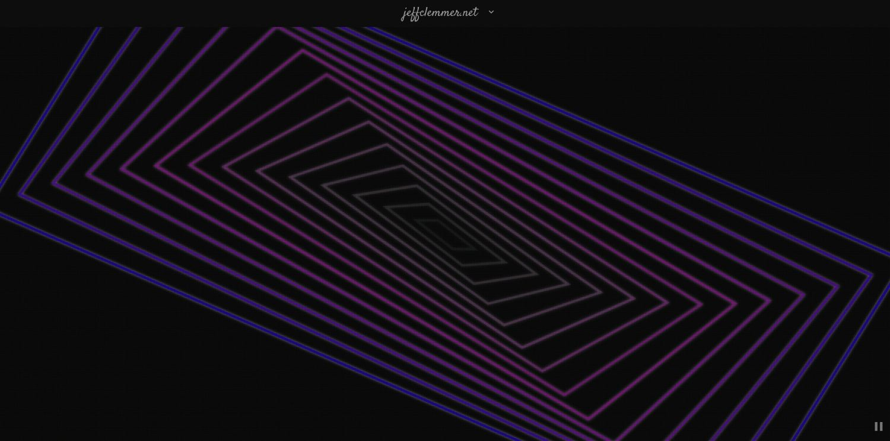

## Trippy Visualizer Component



This took me just under eight hours to write.

I wanted to add something to my personal website that was sort of mesmerizing and helped the viewer "zen out" and relax.  I also wanted to play with some math.  The result is this component.

You can see the component in action on my personal website at:

[https://jeffclemmer.net/](https://jeffclemmer.net/)

This component was written in the Svelte web framework, but is mostly Vanilla Javascript.

[https://svelte.dev/](https://svelte.dev/)

I also wanted the graphics to be inline with old computer terminals from back in the 80s.  The pixelated look and the low frame rate is done on purpose.  I limited the framerate to 15 FPS, no matter what framerate your system supports.  I also made the colors somewhat muted to play into a dystopian CRT display style look and feel.

## Using in your project

In Svelte project, just copy to your components folder and
```
import Rects from "./path/to/components/Rects.svelte";
```

Then, in your HTML use:
```
<div class="container" bind:clientWidth="{width}" bind:clientHeight="{height}">
  <Rects {animating} {width} {height} lineWidth={5} maxRects={15}></Rects>
</div>
```

The above will fill the entire div with the Rects component.

> {animating} is a boolean

> {width} is an integer

> {height} is an integer

> {lineWidth} is an integer and controls the width of each rectangle drawn

> {maxRects} is an integer and controls how many total rectangles are drawn

## More Info About How This Works

Modern browsers contain the HTML5 **\<canvas\>** element, which in turn includes a new feature that implements a timed rendering loop, **window.requestAnimationFrame()**.  This loop is accurate to the framerate of your system framerate, or at least to its best ability.

This animation loop is a better option than setInterval() because it's a constant time system, whereas setInterval is fired on a best effort basis.

I utilize this loop to draw each frame in a consistent manner.  I use a simple FPS detector upon component initialization, **onMount()**.  This is then used to calculate down to 15 FPS, my desired framerate for this component.

Also, to make things a little more performant, I precalculate my sine and cosine calculations and put those into a fast lookup table.  This makes things a bit more efficient and less processor intensive.

Once setup is complete, I draw each rectangle as it becomes available.  I also do some calculations to rotate the rectangles in succession.  Each inner rectange is sort of like an "echo" of the previous outer rectangle, with the most outer rectangle being the "first" rectangle.

I implemented a muted rainbow algorithm to cycle through colors for each frame drawn.

Everything is randomly generated, including color cycling, rectangle rotation direction, and rotation amount.